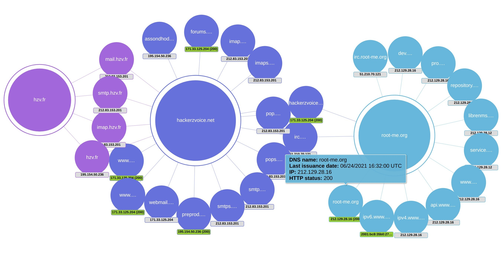
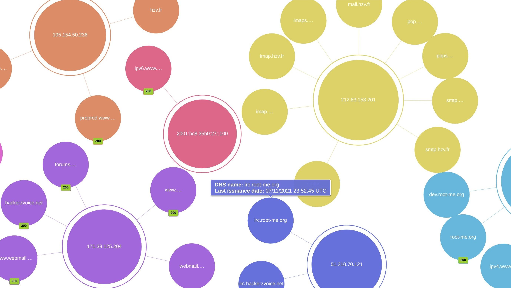
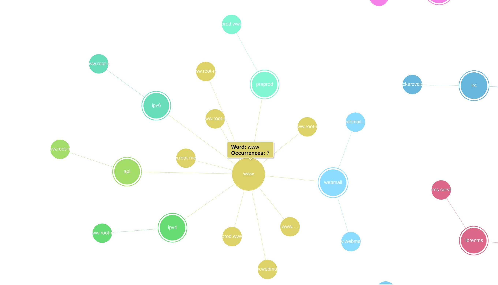

# Gcert

This tool retrieves SSL/TLS certificate reports information from the [Google Transparency Report](https://transparencyreport.google.com/https/certificates) for a given domain.

Then it does a DNS resolution and HTTP/S GET requests for filtering and information purposes if the `-r` argument is provided.

It also performs a recursive domain discovery with a configurable depth level.

The final report is sent to *stdout* and the progression to *stderr*.

The HTML report provides a force-directed tree graph to analyze the results (thanks [NorthBlue333](https://github.com/northblue333) :tada:) :

`docker run --rm hessman/gcert -t root-me.org -r -l 1 -d cloudflare.com cloudflaressl.com > sample.html`

The `sample.html` HTML is available [here](./sample.html).

By domain :


By IP :


By word :


It can be filtered by DNS resolution and last certificate issuance date.

## Quick start

```
docker pull hessman/gcert:latest

docker run --rm hessman/gcert -h

Usage: gcert -t domain.tld -r -d google.com google.fr -o html > report.html

Retrieves SSL/TLS certificate reports information from the Google Transparency Report for a given domain.

Options:
  -v, --version                 output the current version
  -t, --target [domain]         set the target domain
  -l, --depth-level <level>     set the depth level for the recursive domain discovery (default: "0")
  -o, --output-format [format]  set the format for the report sent to stdout (choices: "csv", "html", "json", default: "html")
  -R, --only-resolved           only output resolved domains
  -r, --resolve                 perform DNS and HTTP/S checks on domains
  -d, --deny-list [domain...]   set the deny list for domains
  -h, --help                    display help for command
```